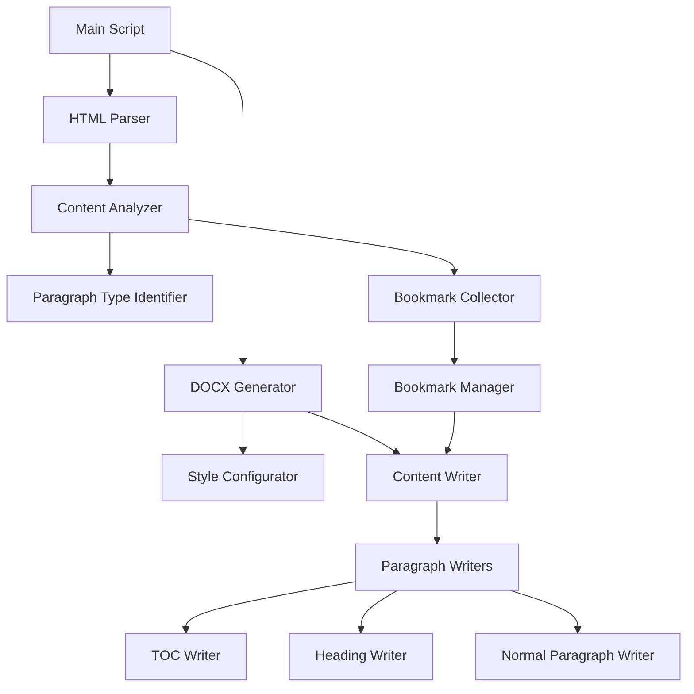

# HTML to DOCX Converter Plan

Based on our discussion and the requirements, this document outlines a comprehensive plan for creating a new Python-based HTML to DOCX converter that will read irish-boy.html and generate a DOCX file programmatically.

## Overview

We'll create a standalone script with functions for different paragraph types, using BeautifulSoup for HTML parsing and python-docx for DOCX generation. The converter will process the HTML file, identify different types of content, and create appropriate elements in the DOCX file.

## Requirements

1. **Content Processing**:
   - Identify blocks without text content and skip them
   - Identify bookmarks and add them
   - Identify paragraph types (toc/p/h1/h2/h3/etc) and run corresponding functions

2. **Writing Features**:
   - Bookmarks get linked during the next written content, not immediately
   - H2 does a section-page-break, assuming at least one TOC has been encountered
   - TOC writes a PageRef form field to link to the bookmark so the page number is displayed
   - Page and styles are configured globally with specific margins and formatting

## Architecture



## Implementation Plan

### 1. Setup and Initialization

```python
def setup_document():
    # Create new document
    # Configure global styles
    # Set up page margins (mirrored 1" top/inside 0.75" bottom/outside 0.4" header)
    # Configure normal style (Book Antiqua 10pt, full justification, 1.15 spacing, 11.5pt after-spacing)
```

### 2. HTML Parsing

```python
def parse_html(html_file):
    # Read HTML file
    # Parse with BeautifulSoup
    # Return soup object
```

### 3. Content Analysis

```python
def analyze_content(soup):
    # Identify and collect all elements
    # Filter out elements without text content
    # Identify bookmarks
    # Categorize elements by type (toc, h1, h2, h3, p, etc.)
    # Return structured content
```

### 4. Bookmark Management

```python
def collect_bookmarks(soup):
    # Find all bookmark elements
    # Store bookmark information (id, target)
    # Return bookmark dictionary
```

### 5. Paragraph Type Handlers

```python
def process_toc(element, document, bookmarks):
    # Process TOC element
    # Add appropriate styling
    # Add PageRef form field to link to bookmark
    # Return processed paragraph

def process_heading(element, document, level, bookmarks, toc_encountered):
    # Process heading element based on level
    # Add appropriate styling
    # If h2 and toc_encountered, add section page break
    # Return processed paragraph

def process_paragraph(element, document, bookmarks):
    # Process normal paragraph
    # Add appropriate styling
    # Return processed paragraph
```

### 6. Link Management

```python
def create_link(paragraph, bookmark_id, bookmarks):
    # Create hyperlink in paragraph to bookmark
    # Return updated paragraph
```

### 7. Main Processing Loop

```python
def process_document(html_file, output_file):
    # Setup document
    # Parse HTML
    # Collect bookmarks
    # Initialize variables (toc_encountered, pending_bookmarks)
    # For each element in structured content:
    #   Identify type
    #   Call appropriate handler
    #   Handle any pending bookmarks
    #   Update state variables
    # Save document
```

## Detailed Implementation Considerations

### Document Configuration

- Set up mirrored margins (1" top/inside, 0.75" bottom/outside, 0.4" header)
- Configure normal style with Book Antiqua 10pt, full justification, 1.15 spacing, 11.5pt after-spacing
- Create styles for headings and TOC entries

### Bookmark and Link Handling

- When a bookmark is encountered, store it in a pending bookmarks list
- When the next content is written, link it to any pending bookmarks
- Clear the pending bookmarks list after linking

### TOC and Page References

- For TOC entries, create a paragraph with the appropriate style
- Add a PageRef form field that links to the corresponding bookmark
- Format the TOC entry according to requirements

### Section Breaks

- Track whether a TOC has been encountered
- When an H2 heading is encountered after a TOC, insert a section page break
- Configure the new section with the same page settings

### Content Filtering

- Check if elements have text content before processing
- Skip elements without meaningful text content
- Handle special cases like empty paragraphs or purely decorative elements

## Testing Strategy

1. **Unit Testing**:
   - Test individual functions for parsing, style configuration, and paragraph processing
   - Verify bookmark collection and linking functionality

2. **Integration Testing**:
   - Test the complete conversion process with sample HTML files
   - Verify that all paragraph types are correctly processed

3. **Validation**:
   - Compare the generated DOCX with expected output
   - Check formatting, links, and page breaks

## Implementation Timeline

1. **Setup and Basic Structure** (Day 1)
   - Create project structure
   - Implement document setup and configuration
   - Set up HTML parsing

2. **Content Processing** (Day 2)
   - Implement content analysis
   - Create paragraph type handlers
   - Implement bookmark collection

3. **Advanced Features** (Day 3)
   - Implement link creation
   - Add TOC and PageRef functionality
   - Handle section breaks

4. **Testing and Refinement** (Day 4)
   - Test with irish-boy.html
   - Fix any issues
   - Optimize performance

5. **Documentation and Delivery** (Day 5)
   - Document code
   - Create usage examples
   - Deliver final solution

## Conclusion

This plan outlines a comprehensive approach to creating a new Python-based HTML to DOCX converter that meets all the specified requirements. The modular design with separate functions for different paragraph types will make the code maintainable and extensible. By using BeautifulSoup for HTML parsing and creating bookmarks and links as we process the HTML elements, we'll ensure efficient and accurate conversion.